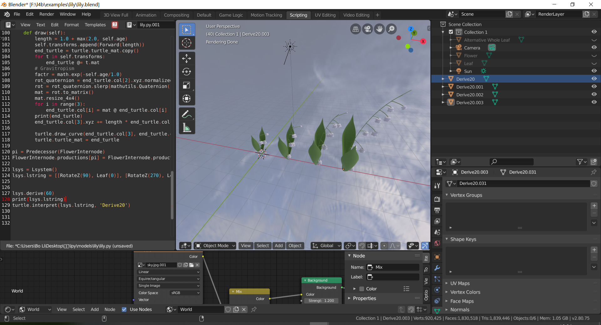
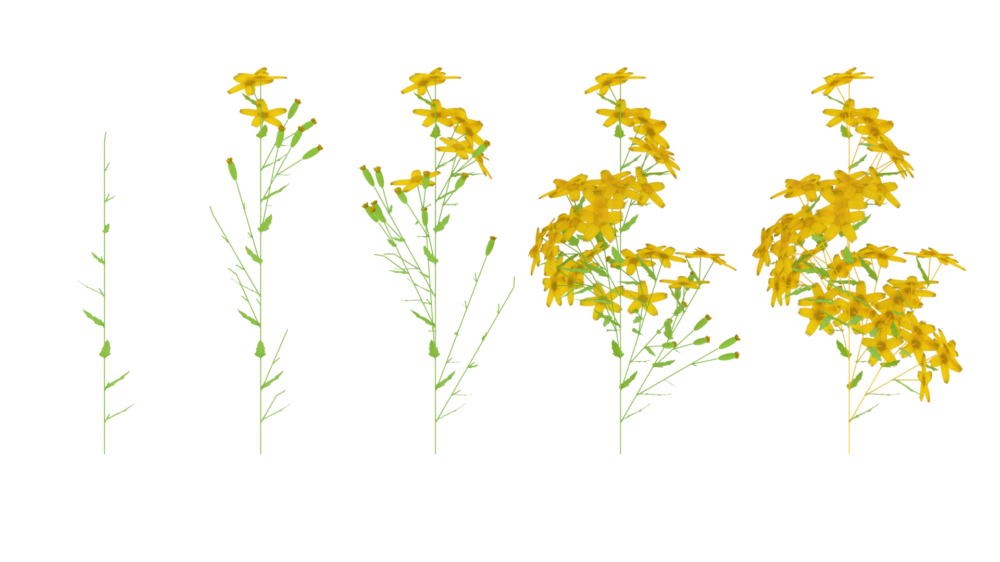

# l4b: L-system for Blender

## Introduction

l4b is an implementation of [L-system](<https://en.wikipedia.org/wiki/L-system>), which is a procedural rewriting system to generate plant models from a set of pre-defined rules. It utilizes the powerful 3D graphics functions of the open-source software [Blender](<https://www.blender.org/>). It is written in pure Python and runs in the built-in interpreter of Blender. It also includes eval (evaluate the derived L-string to a directed graph) and typing (check whether the derived L-string is valid) features for the final project of the course [Design Principles of Programming Languages](https://xiongyingfei.github.io/DPPL/main.htm).





## Installation

To use l4b, you will need to install [Blender](<https://www.blender.org/>), with version 2.80 or above. 

To test out the eval and typing, see the readme and report under dppl-report (in Chinese).

## Usage

To generate a procedural plant model, you basically need to do three things in a Python .py script and just run that script in Blender's Python interpreter. You can refer to examples folder in the repository.

- Define the modules and productions of the L-system. A `Module` is distinct component of a plant, such as a flower, a leaf, etc. Productions are rules about how a module changes in a step. For example, an apex may divide into leaves. This is an showcase about how to define a `Module` and its attached `productions` from the *lychnis* example:

  ```python
  @dataclass
  class Apex(Module):
      age: int
  
      def production_1(self):
          if self.age == 7:
              return Internode(8), \
                     [RotateY(+40), Leaf(0)], \
                     RotateZ(90), [RotateX(-30), Apex(0)], \
                     RotateZ(90), [RotateY(+40), Leaf(0)], \
                     RotateZ(90), [RotateX(-30), Apex(4)], \
                     Internode(3), Flower(0)
          elif self.age < 7:
              return Apex(self.age + 1)
  
  
  pa = Predecessor(Apex)
  Apex.productions[pa] = Apex.production_1
  ```

  Defining a `Module` is just like defining a class in Python, but it must inherit from the base class `Module` (which should be imported from lstring.py). Just like a class, it encapsulates some internal attributes.  The `@dataclass` annotator is to help simplify stringifying a `Module`.  Next, its productions are defined as member functions, which include information about what successor modules a single node will generate. RotateZ and analogs are to control the transform 

  You will need to add productions to the `productions` list of a `Module` by hand. It is not that elegant though, there should be no difficulty to implement more neat methods to manage the productions.

- Create an `lsystem` and assign it an initial `lstring`. Run some certain steps to get the derived string:

  ```
  lsys = Lsystem([Apex(0)])
  lsys.derive(20)
  ```

  You can see the derived lstring in the console by:

  ```
  print(lsys.lstring)
  ```

- Interpret the lstring to a 3D model:

  ```
  turtle.interpret(lsys.lstring, 'lychnis')
  ```

  All modules that represent actual geometry must implement their `draw` functions.

At the beginning of the script, change the path to your own l4b/src folder (see examples) and import needed infrastructures from  lstring.py, transform.py, lsystem.py and turtle.py.

## References

Knowledge about L-system:

[1]Prusinkiewicz, Przemyslaw, and Aristid Lindenmayer. *The algorithmic beauty of plants*. Springer Science & Business Media, 2012.

[2]Federl, Pavol, et al. "L-systems and Beyond." *Course Notes, SIGGRAPH* 2003.