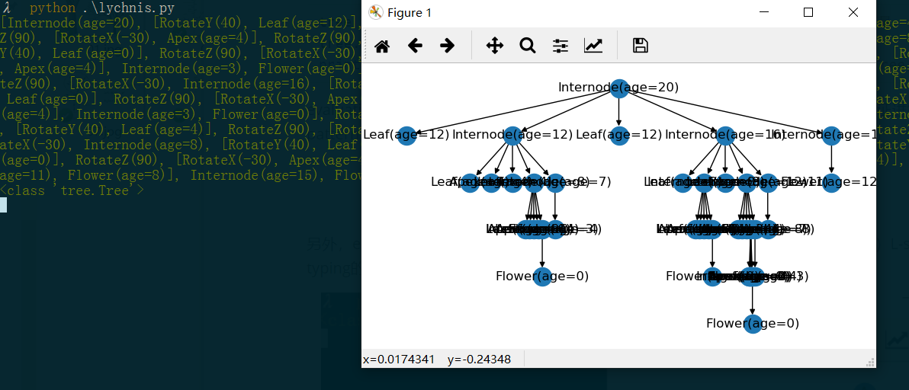
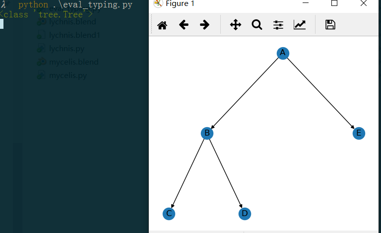

# 使用说明

代码大致有两种使用方法：

### 在一般的Python 3解释器执行

这种情况下，主要进行L-string的derivation，evaluation和typing，但不能进行把L-string翻译成三维模型的操作。在使用的Python解释器环境下，需要安装networkx（可以使用pip/conda），其他的依赖都是常见的包，在默认Python环境下应该都已安装。需要注意的是，代码中使用了Python 3.7以上引入的类修饰符dataclass（参见PEP 557），而常见的Python达不到这个版本。因此，代码中附带了dataclassess.py，以解决这一问题。

examples下有三个例子：lychnis.py和mycelis.py是两个用L-system的产生式产生L-string的例子。（注意，运行前，需要把文件开头的**code_folder**变量改成**代码所在文件夹**的绝对路径。）它们的第一部分是L-system的描述，主要是Module类型的定义，以及对应的产生式。第二部分是执行的语句：

```python
lsys = Lsystem(axiom)   # 创建一个L-system
lsys.derive(nsteps)  # 迭代指定的步数
```

lsys.lstring就是迭代后产生的L-string（由Module和Transform组成的nested list）。可以对这个L-string进行evaluation，得到networkx中的一张有向图；或者typing，进行类型检查：

```python
tree = eval(lsys.lstring)  # 对L-string进行evaluation，得到Tree类型的变量
tree.show()  # 在matplotlib中产生L-string对应树的有向图表示
print(typeof(lsys.lstring))  # 不进行evaluation，通过typing验证其类型为Tree，即L-string是规范的
```

evaluation可以帮助快速可视化L-string的结构，typing则在L-system中被使用，以保证进行上下文相关产生式的pattern matching之前，L-string是规范的。



另外，examples/eval_typing.py是几个直接写好的（即，不是通过产生式derive出的）L-string进行evaluation和typing的例子（见下图），不规范的L-string在evaluation和typing中会抛出异常。



### 在Blender中绘制三维模型

要对L-string进行interpret得到三维模型，我们借助开源3D软件Blender作为平台。Blender也以Python为脚本语言，有自己内置的解释器。在官网下载安装Blender （<https://www.blender.org/>，需2.80以上版本），打开examples下的.blend场景文件，直接执行对应的脚本即可。（注意，在一般的Python解释器中无法进行turtle interpretation；在Blender中则由于不方便安装networkx，不进行evaluation）。另外还有一个需要注意的问题是，Blender 2.80的Python解释器是3.7版本以上的，好像会和dataclasses.py产生冲突，在Blender中执行时把项目下的dataclasses.py改个名字或者直接删掉，从而让其定位Blender Python解释器自带的dataclasses包即可。
